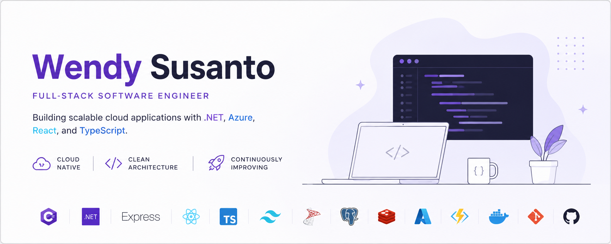

# Hi, I'm Wendy 👋

Full-Stack Software Engineer specializing in .NET, Azure, React, and TypeScript.

📍 Indonesia

☁️ Azure Developer Associate (AZ-204)

🚀 Building production-ready cloud applications

---

## Tech Stack

### Backend

  

### Frontend

   

### Database

   

### Cloud

     

### DevOps

  

---

## 🏅 Certification

    

**Microsoft Certified: Azure Developer Associate (AZ-204)**

# Let's Connect

